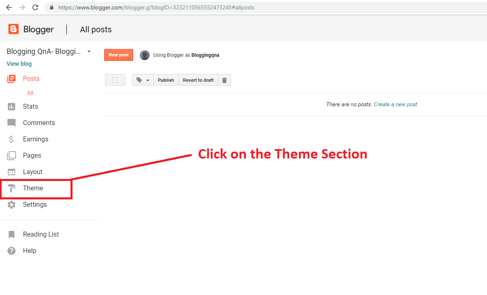
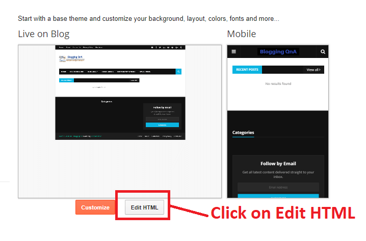
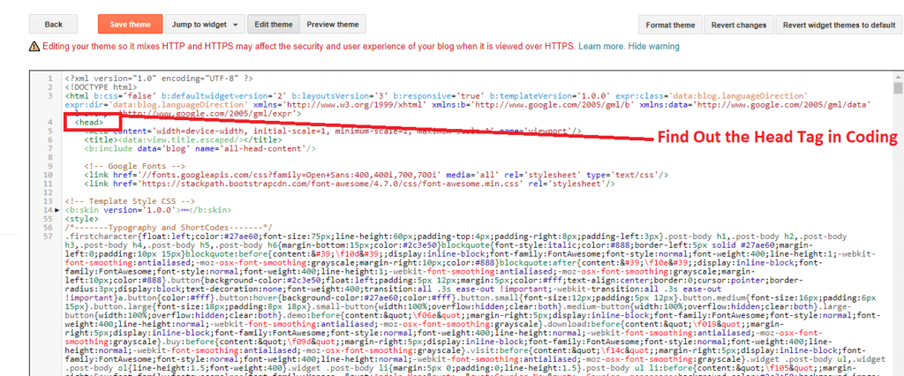
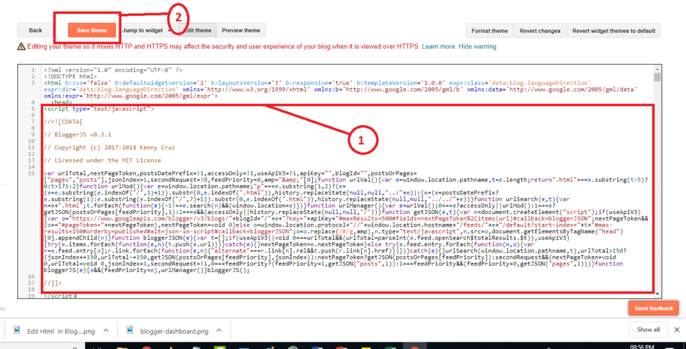

# BloggerJS v0.3.1 Delete Date & Time from URL

Remove Date From Blogger Post URL: Want to Create your Blogger Post URL like WordPress Posts URL?

If yes, then you are at the Right Place!

In this Repo, I will share a step-by-step guide of How to Remove a Date from a Blogger Post URL.

So, Be with me till the end, to know more in detail.

Whenever we create a post on Blogger, That will contain the published date of that Post. 

Below is the screenshot of the default blogger post URL.

But, when you write a post on WordPress, its URL is completely different, here the date and .html will not come in the post URL.

WordPress post URL looks professional as compared to the blogger default Post URL. 

That’s why I recommend you all, if, you have just started a blog on Blogger,
Use this technique to Remove the date from the blogger post URL. 

This will make your Blogger Blog professional like WordPress.

The Permalink of Blogger is Auto-generated and you can also do it manually, But in both cases, the date will be there.

But, with this method, you can remove the date from the blogger’s every post, and even in a future post, the date will not be there.

# Benefits of Removing Date Form Blogger Post URL
A Common search term that every blogger search is How to Remove Date From Blogger Post URL or How do I remove date from Blogger permalink?

First of all, let me tell you some Benefits of Removing the Date From a Blogger Post URL:

* Removing Date From Blogger Blog Posts will make your content Evergreen.
* Gives Professional Permalink to your Blog Posts.
* It Won’t Let visitors know on which date the post is published.
* Helps in the Better ranking is Search Engine Result Pages.
* Make your Blog Post URL Short.
* It will give a professional look to your blog post.
* 
Above are the benefits which you will get by removing the date from the blogger posts URL.

# Disadvantages of Removing Date From Blogger Post URL
Removing the date from the Posts URL is good, but only for new bloggers, Who has just started their blog on Blogger?

If you have already a well-established Blogger Blog, and your blog posts are ranking in Google Search Engine Result Pages.

Then, it would be better if you didn’t take the risk of changing Posts URL.

Because it will effeminately affect the SEO of your blog.

Let me explain to you:

If any of your blog posts are ranked in Google with the date in the URL, and after the date, with this method, you removed the date from the URL.

The previous link in which the date is there will be 404, Which is a page not found Error.

This will affect your website SEO badly, So beware of changing Post URL if, it is ranked in Google Searches.

# How to Correctly Add JavaScript Code in Blogger?

Adding Scripts in Blogger is extremely straightforward.

All you need to do is to go to Blogger.com >> Your site >> Template >> Edit HTML. 

Now it depends on you where you would like to paste your JavaScript code. 

However, I prefer you to add it above the </head> tag because this is the place where all technical things are present. Here’s how the code would look like:

```js
<script type='text/javascript'>
//<![CDATA[
INSERT JAVASCRIPT CODE HERE
//]]>
</script>
```

Now, How To Remove Date From Blogger Post URL Step By Step?

Here, I will show you the method step by step with the help of screenshots.

So let’s get into it.
### Step 1: Login Into Your Blogger Dashboard and head over to the theme section.

### STEP 2: After clicking on the Theme section, Get into the “Edit HTML”.

### STEP 3: Now, Find out the <head> tag here. You can also find it out with the help of Cntrl+F.

### Step 4: Now, Copy the Given Code Paste it after the <head> tag, and click on Save theme.


## Give a Star! ⭐️
If you find this repository useful, please give it a star. Thanks!
